# ChaanBean — System Architecture

> Outbound credit recovery for the Indian B2B market. Invoices in; a
> deterministic escalation ladder out; a recorded, machine-readable refusal
> whenever a contact should not happen.

This document describes the system as built. Where something is deliberately
*not* built, or is built against a fixture provider pending a commercial
contract, it says so. Sections marked **Decision** record a trade-off and the
reasoning behind it, so a future maintainer can tell an intentional constraint
from an oversight.

**Contents**

1. [System context](#1-system-context)
2. [Architectural position](#2-architectural-position)
3. [Module map and enforced boundaries](#3-module-map-and-enforced-boundaries)
4. [Runtime topology](#4-runtime-topology)
5. [The escalation pipeline](#5-the-escalation-pipeline)
6. [The policy engine](#6-the-policy-engine)
7. [Voice: call lifecycle and reconciliation](#7-voice-call-lifecycle-and-reconciliation)
8. [Data model](#8-data-model)
9. [Multi-tenancy and the security model](#9-multi-tenancy-and-the-security-model)
10. [Identity and authorization](#10-identity-and-authorization)
11. [Credit intelligence](#11-credit-intelligence)
12. [Money, numbers and language](#12-money-numbers-and-language)
13. [Concurrency, idempotency and rate control](#13-concurrency-idempotency-and-rate-control)
14. [The portal](#14-the-portal)
15. [Failure modes](#15-failure-modes)
16. [Observability](#16-observability)
17. [Scaling path](#17-scaling-path)
18. [Compliance posture](#18-compliance-posture)
19. [Decision log](#19-decision-log)

---

## 1. System context

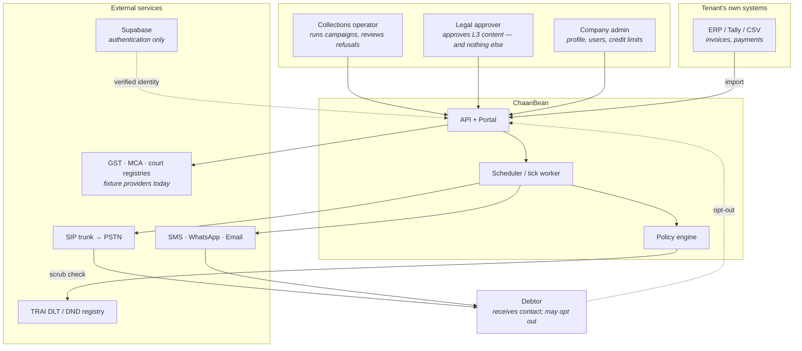

**What the system is responsible for.** Deciding *who* to contact, *when*, on
*which channel*, with *what content* — and recording why, every time, including
when the answer is "do not contact".

**What it is explicitly not responsible for.** Holding the debt (that stays in
the tenant's ERP), deciding whether a debt is valid, or conducting a
conversation. See [§19](#19-decision-log).

---

## 2. Architectural position

The system optimises for **provability under dispute** ahead of throughput,
because the failure that ends the business is not a slow campaign — it is a
debtor demonstrating in front of a regulator that they were called after opting
out, and the operator being unable to show otherwise.

Four constraints follow, and they explain most of what looks unusual below:

| Constraint | Consequence |
|---|---|
| Every decision must be reconstructable | Append-only event logs; pure policy engine; versioned scorecards |
| Every refusal must name itself | `BlockReason` is a closed enum in one file; 23 members, each tested |
| No generated text reaches a debtor | Deterministic template merge; no LLM in the call path |
| Fail closed | Unknown DND blocks. Stale scrub blocks. Missing audio blocks. There is no default-allow path |

### Voice is one-way and template-driven

No speech recognition, no dialogue, no language model in the call path, no GPU.
A recorded message is played; the debtor presses a key or does not.

**Decision.** A conversational agent would be a better demo and a worse product
here. The exact words spoken to a debtor are evidence, and evidence must be
reproducible from a template id plus merge fields — not from a sampled
generation that cannot be replayed. The constraint also removes GPU cost, ASR
latency, and an entire class of compliance exposure.

---

## 3. Module map and enforced boundaries

A **modular monolith**, not microservices. Boundaries are enforced in CI by
[import-linter](https://import-linter.readthedocs.io/) — `lint-imports` — and
the build fails on a violation.

**Decision.** A boundary that is only a convention stops being a boundary in
week three. Enforcing it now, while there are thirteen modules rather than
twelve services, costs one config file. Microservices would buy independent
scaling that nothing here needs, at the price of distributed transactions across
a ledger — which is the one place this system cannot afford eventual consistency.

### Contract 1 — layered domain

Imports flow downward only. Any upward import fails the build.

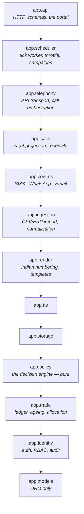

`app.telephony` sits **above** `app.calls`: `telephony/flow.py` orchestrates call
state, while the ARI transport beneath it depends on nothing. The dependency is
one-way and acyclic — `app.calls` imports nothing from `app.telephony`.

### Contract 2 — providers depend on nothing in the domain

`app.providers` (carriers, registries, scrub services, TTS vendors) may not
import `api`, `calls`, `comms`, `policy`, `scheduler`, `telephony` or `trade`.

This is what makes a vendor swap a configuration change. `TELEPHONY_BACKEND`,
`TTS_BACKEND`, `STORAGE_BACKEND` and `SMS_BACKEND` each select an adapter behind
a stable interface, and the whole system runs end to end on local adapters with
no vendor account at all.

### Contract 3 — the policy engine touches no I/O

`app.policy` may not import `app.db`, `app.providers`, or `sqlalchemy`.

The engine receives a context object and returns a decision. It has no database,
no network and no clock of its own — the evaluation time is passed in. Every
production decision is therefore reproducible from stored context, which is the
difference between an auditable system and an opinion.

---

## 4. Runtime topology

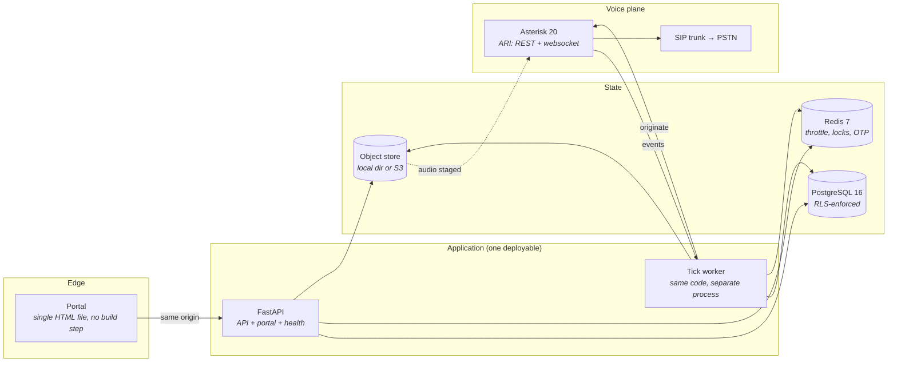

**One deployable, two process types.** The API and the scheduler run the same
codebase; only the entrypoint differs. The voice worker is the first thing that
would be extracted, when real-time media needs a different scaling curve from
CRUD — not before.

Health is exposed at `/health` and reports the two facts an operator actually
wants (database reachable, Redis reachable) plus which adapters are live, so a
"working" system that is silently on the fake telephony backend is visible.

---

## 5. The escalation pipeline

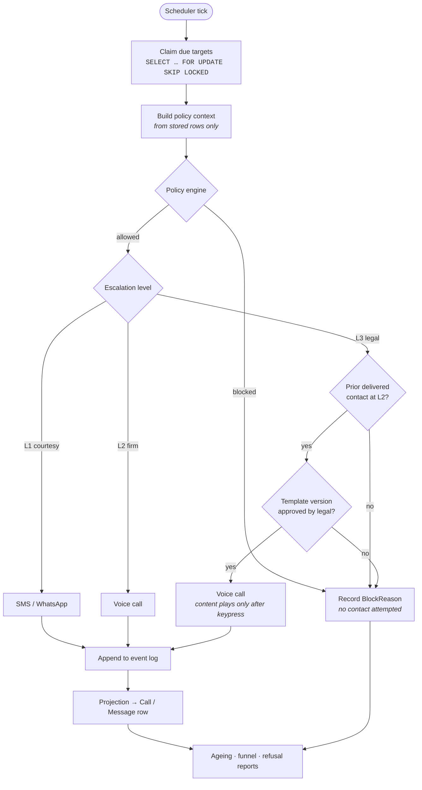

The ladder is **deterministic**: L1 → L2 → L3, cheapest channel first, and L3 is
reachable only from a *delivered* contact at L2.

**Decision — why L3 requires prior delivered contact.** Escalating to legal
language because three calls went unanswered is both unfair and evidentially
weak: an unanswered call is not evidence the debtor knows about the debt. The
ladder advances on delivery, not on attempts.

**Decision — why L3 content plays only after a keypress.** Playing a debt amount
to whoever picks up a shared office line is a third-party disclosure problem.
The keypress is a weak but real assertion that the right person is listening.

---

## 6. The policy engine

`app/policy/engine.py` is a pure function from context to decision. It is the
only place `BlockReason` is defined.

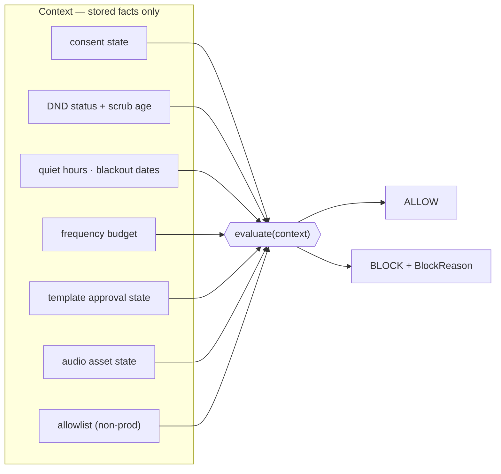

Gates are ordered by precedence, and **consent withdrawal beats every other
gate** — including an operator override. A representative slice:

| Reason | Fails closed because |
|---|---|
| `CONSENT_WITHDRAWN` | Absolute. No override path exists |
| `DND_UNKNOWN` | Never scrubbed is not the same as clear |
| `DND_CHECK_STALE` | A scrub older than 7 days is not current |
| `L3_TEMPLATE_NOT_APPROVED` | Legal wording with no recorded approval is not legal wording |
| `QUIET_HOURS` | Contact outside permitted hours |
| `AUDIO_MISSING` | A call with no audio is a silent call to a debtor |
| `ALLOWLIST_MISS` | Non-production must not dial real numbers |

The test suite asserts that **every** enum member has a case, and fails when a
new member is added without one. Each guard has been watched to fail with the
guard removed — a test that has never failed proves nothing.

---

## 7. Voice: call lifecycle and reconciliation

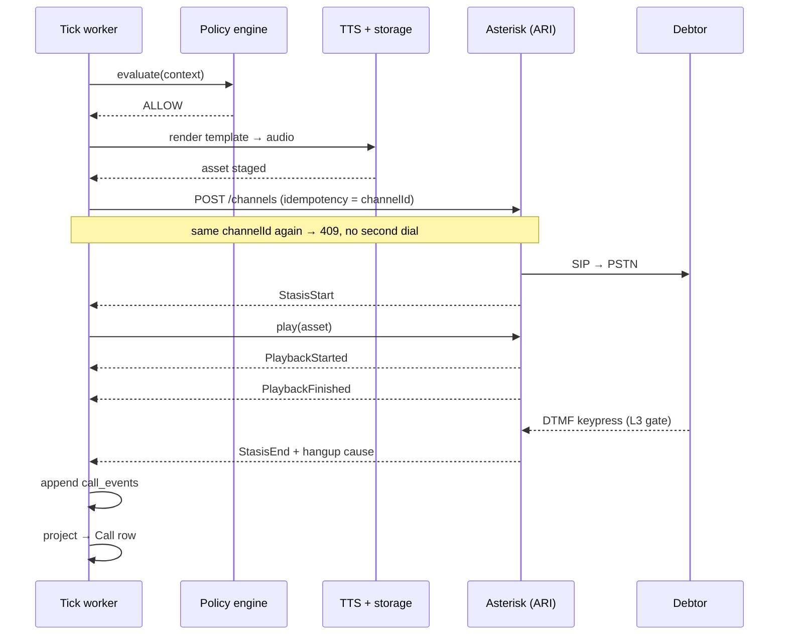

### Events are the source of truth

`call_events` is authoritative; the `Call` row is a **projection** of it.

ARI has no event replay, so events arrive late, duplicated, out of order, or
never at all. The projection is therefore **idempotent, order-independent and
forward-only**, and a test proves a `Call` row can be rebuilt identically from
its event log alone.

### Three independent reconciliation layers

Any single layer can miss, so there are three:

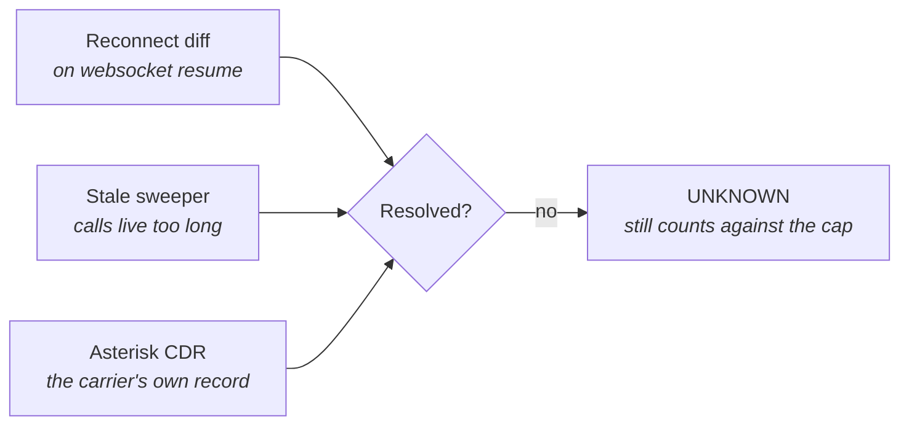

**Decision — unresolved calls resolve to `UNKNOWN`, not `NO_ANSWER`.**
`NO_ANSWER` is a positive claim that the phone rang and nobody picked up. When
all three layers come up empty, the system does not know that. It cannot prove
the phone did not ring, so it says so — and the attempt still consumes the
debtor's frequency budget, because the alternative is retrying a debtor who may
already have been called.

**Decision — carrier faults do not consume the debtor's budget.** A 503 from the
trunk is our problem, not evidence the debtor was contacted.

### The ARI 409 nuance

ARI returns 409 for a duplicate `channelId` **only while the channel is live**.
Once destroyed the id is reusable. So 409 is a *concurrent-duplicate guard*, not
a durable record. Durability comes from the unique index on
`calls.idempotency_key`. This was discovered against real Asterisk 20.9.3, not
against a stub, and is documented at the call site in `app/telephony/ari.py`.

---

## 8. Data model

Core entities and the relationships that carry the invariants:

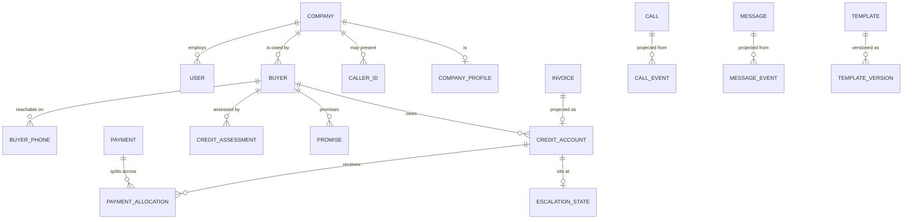

Four modelling decisions carry most of the weight:

**DND belongs to the phone number, not the person.** A debtor with a scrubbed
mobile and a clear office landline is the normal case. Putting the flag on the
buyer either blocks a callable number or dials a scrubbed one.

**Consent belongs to the person, not the number.** The mirror of the above:
withdrawing consent must apply across every number they own.

**The buyer is the scheduling unit, not the invoice.** One conversation at a
time with one person, however many invoices they owe — so `next_action_at` lives
on `Buyer`, not on the per-account escalation ladder.

**`outstanding_paise` is derived and has exactly one writer.** A payment is not
"against an invoice": part payment across several invoices is the norm in Indian
B2B trade, so allocation is explicit. Two code paths adjusting a balance is how
ledgers drift, and a drifted ledger tells a debtor they owe money they have paid.

### Append-only history

`call_events`, `message_events`, `risk_scores`, `credit_assessments` and
`audit_log` are **never updated in place**. You have to be able to answer "what
did we know when we escalated this account on 12 March", and an overwritten row
cannot.

---

## 9. Multi-tenancy and the security model

Isolation is enforced by **PostgreSQL Row-Level Security**, not by `WHERE`
clauses in application code.

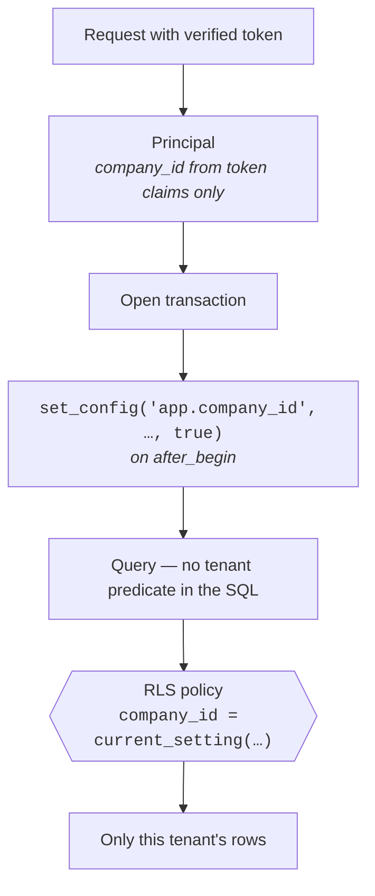

### Three database roles

| Role | RLS | Used by |
|---|---|---|
| `crp_app` | **NOBYPASSRLS** | The application. Every tenant request |
| `crp_worker` | BYPASSRLS | Cross-tenant workers, and token→tenant resolution |
| `crp` | superuser | DDL and migrations only |

**Decision — the app must not connect as the table owner.** `FORCE ROW LEVEL
SECURITY` is set on every tenant table, because without it the owning role
bypasses the policy silently — and a superuser bypasses RLS even with FORCE.
This was found the hard way: RLS was completely inert while the application
connected as the bootstrap superuser, and every policy was decoration.

**Decision — `set_config(..., true)` on `after_begin`, not `SET LOCAL`.**
`SET LOCAL` takes no bind parameters, which would mean interpolating a tenant id
into SQL. The transaction-scoped `set_config` binds properly and is reset at
commit, so a pooled connection cannot leak a tenant into the next request.

**Fail closed:** the policy uses
`NULLIF(current_setting('app.company_id', true), '')::uuid`. An unset variable
yields `NULL`, and `company_id = NULL` is `NULL` rather than true — so an
unbound session sees **no rows**, never all rows.

Isolation is tested in **both directions**: the row is invisible to the other
tenant, *and* demonstrably present when read past the policy — because a test
that only asserts absence also passes when the table is empty.

Every migration that creates a tenant table also enables forced RLS and grants
the app roles, rather than relying on an out-of-band command being remembered.

---

## 10. Identity and authorization

Two interchangeable backends, selected by `AUTH_BACKEND`:

- **local** — bcrypt password hashes, our own JWTs
- **supabase** — Supabase issues the token; we verify it

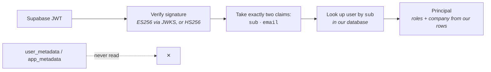

**Decision — Supabase answers *who*, never *what they may do*.** A Supabase JWT
carries `user_metadata`, and `user_metadata` is writable by the user through the
client SDK. A token claiming `user_metadata.role = "legal_approver"` proves
nothing — if authorization read from there, any signed-up user could approve L3
legal content by editing their own profile. Roles and tenancy come from our
tables, keyed on the verified `sub`. This is mutation-tested.

A user authenticated by Supabase but unknown to us is **403, not auto-provisioned**
— otherwise anyone who can sign up to the Supabase project lands inside a tenant.

A JWKS fetch failure is **503** (our outage, retry) while a token matching no
published key is **401** (re-authenticate). Collapsing them makes a client with a
stale token retry forever instead of logging in again.

### Roles

| Role | Notably holds | Notably lacks |
|---|---|---|
| `viewer` | read | every write |
| `operator` | buyers, imports, campaigns, credit *checks* | granting credit; approving L3 |
| `admin` / `owner` | users, API keys, company settings, credit *decisions* | **approving L3 legal content** |
| `legal_approver` | approving L3 content, audit read | everything else |

**Decision — `TEMPLATE_APPROVE_L3` belongs to no administrative role, including
owner.** Approving the legal words said to a debtor is a legal act, not an
administrative privilege. Separating it means the person who can grant
themselves permissions still cannot approve legal content.

---

## 11. Credit intelligence

Two related but distinct questions, deliberately kept apart:

| | Question | Scale |
|---|---|---|
| `scoring.py` | How hard will this be to collect? | 0 safe → 100 risky |
| `creditworthiness.py` | Should we extend more credit? | 0 weak → 100 strong |

The scales run in opposite directions and the risk score is inverted where it is
consumed, rather than either scale being bent to match — two scales that mean
opposite things but look identical are how somebody eventually reads one as the
other.

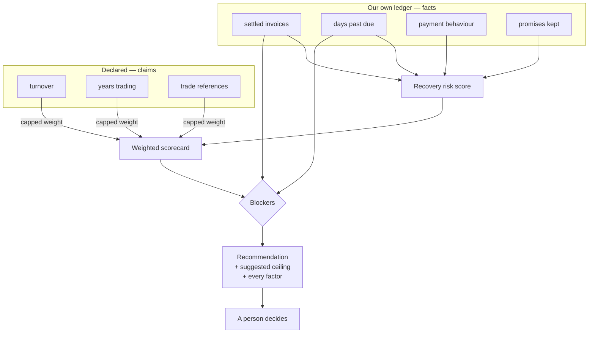

**Decision — a transparent weighted scorecard, not a learned model.** Every
output must survive the question *"why did you refuse them?"*, asked by the
customer, the buyer, or a regulator. A scorecard answers it by construction:
each factor states its value, weight and contribution in points; the same inputs
always produce the same output; and `MODEL_VERSION` records which rules ran, so a
decision made in March is reconstructable in December. An opaque model can do
none of that, and for a credit decision that is disqualifying rather than merely
inconvenient. When thousands of resolved outcomes exist, a learned model becomes
defensible as a *ranking* aid **inside** this explainable envelope — never as
the sole cause of a refusal.

**Decision — it recommends; it never decides.** The vocabulary is
`STRONG · ACCEPTABLE · CAUTION · REFER`, never APPROVE/REJECT. A person records
the limit they grant, through a separate endpoint under a separate permission,
and the suggestion is preserved alongside the decision — *where the two disagree
is the audit trail*. An automated adverse decision about a real business, on data
they cannot see or correct, is what turns a credit tool into a liability; under
the DPDP Act "the model said so" is not an answer.

**Decision — blockers sit outside the score.** A long history and strong turnover
produce a high score. None of that makes it sensible to extend *more* credit to
someone who has not paid what they already owe you — and averaged into a score,
that fact disappears. Arrears, a 90-day item and a HIGH risk band are therefore
hard blockers that force `REFER` and a zero ceiling regardless of score.

**Decision — declared figures are capped.** What the buyer owes *us* is read
from our ledger, never from the submitted form; letting an applicant supply
their own payment history would defeat the check. Declared turnover carries half
weight unless someone attests to having seen a GST return or bank statement —
otherwise the way to unlock a large limit is to type a large number.

---

## 12. Money, numbers and language

**Money is integer paise, everywhere, with an explicit field name**
(`amount_paise`) — never a float, never a bare `amount`. Floats lose paise, and
lost paise in a legal notice is a wrong number in a legal notice.

**Indian digit grouping is a correctness issue, not a formatting preference.**
`4,50,000` is four lakh fifty thousand. A parser assuming Western grouping reads
it as forty-five thousand — an order of magnitude out, in a number that ends up
in front of a debtor. Parsing lives in exactly one place
(`ingestion/normalise.py`) and rendering in exactly one place
(`render/numbers.py`): `₹42,00,000`, never `₹4,200,000`; "forty-two lakh", never
"four million".

Phone numbers are normalised to E.164 on the way in, or refused. A number stored
as an operator typed it is a number that will not dial — and it will not fail
until the campaign runs at 09:00, by which time nobody remembers typing it.

---

## 13. Concurrency, idempotency and rate control

| Mechanism | Where | Guarantees |
|---|---|---|
| `SELECT … FOR UPDATE SKIP LOCKED` | target claiming | Two workers never claim the same target |
| Derived idempotency keys | calls, messages | Retry cannot double-dial |
| Unique index on `calls.idempotency_key` | database | Durable duplicate protection |
| Redis token bucket (Lua) | origination | CPS ceiling holds across any window |
| Per-tenant channel cap | origination | One tenant's 5,000-row campaign cannot starve everyone |

**Decision — idempotency keys are derived, never random.** For voice the key is
the ARI `channelId`, so a retry presents the same key and Asterisk answers 409
rather than dialling a debtor twice.

**Decision — a token bucket, not a fixed window.** The earlier implementation
keyed on `floor(now)`, which lets through up to 2× the rate across a boundary:
five calls at 12:00:00.9 and five more at 12:00:01.0 is ten calls inside one
second. Against a carrier that caps CPS that is the burst that gets a trunk
throttled — and it is invisible in testing, because it only happens when a batch
straddles a second. Refill, check and consume are one atomic Lua step.

**Decision — the limiter fails closed.** When Redis is unavailable, origination
is refused. A telephony system that keeps dialling after losing track of how fast
it is dialling is the one that gets its trunk suspended.

---

## 14. The portal

A **single HTML file** served from the same origin as the API. No build step, no
bundler, no framework.

**Decision.** The portal is an operations console for a handful of views. A build
pipeline would add a toolchain to maintain, a deployment artifact to version and
a source-map story to debug, in exchange for conveniences this scale does not
need. It is a genuine trade-off: it would not survive a team of six front-end
engineers.

Notable properties:

- **One request per poll.** `/api/portal/state` returns the whole console state
  behind an ETag, so an unchanged poll is a 304 with no body and no aggregate
  queries. The earlier shape was 6 + N requests every fifteen seconds — a
  separate progress call per campaign, per open tab, per tenant.
- **Charts are built at the width they will occupy.** SVG scaled by
  `preserveAspectRatio` shrinks the 12px type along with the bars; charts are
  therefore rendered at their container's real width and corrected after layout.
- **Polling never repaints under an open form**, and a resize re-fits charts
  rather than rebuilding the view — rotating a phone must not discard a
  half-filled credit check.
- **Every chart ships a table view.** Identity and value must be reachable
  without relying on colour.

---

## 15. Failure modes

| Failure | Behaviour | Rationale |
|---|---|---|
| Redis down | Origination refused | Cannot rate-limit; fail closed |
| DND provider down | Contact blocked (`DND_UNKNOWN`) | Never scrubbed ≠ clear |
| Scrub older than 7 days | Blocked (`DND_CHECK_STALE`) | Stale is not current |
| Asterisk websocket drops | Reconnect + diff; sweeper; CDR | Any one layer can miss |
| Call unresolvable | `UNKNOWN`, budget consumed | Cannot prove the phone did not ring |
| Carrier 503 | Budget **not** consumed | Our fault, not evidence of contact |
| Audio asset missing | Blocked (`AUDIO_MISSING`) | A silent legal call is worse than none |
| JWKS unreachable | 503 | Our outage; client should retry |
| Token matches no key | 401 | Client should re-authenticate |
| Unbound tenant session | Zero rows | RLS `NULL` comparison, not true |

---

## 16. Observability

- **`/health`** — liveness plus database, Redis, and which adapters are live.
- **Audit log** — append-only, tenant-scoped, actor-attributed. Covers
  `credit.assessed`, `credit.decided`, `company.profile.update`, template
  approvals, and every privileged action.
- **Event logs** — `call_events` / `message_events` are the source of truth, so
  the state of any call is explainable by replay rather than inference.
- **Refusal reporting** — refusals are a first-class dashboard, not an error
  count. "Why isn't it calling anyone" is the support ticket this prevents, and
  each `BlockReason` maps to an operator-facing sentence.

---

## 17. Scaling path

Ordered by what would actually hurt first:

1. **Read replicas** for reporting. The ageing and funnel aggregates are the
   heaviest queries and are already ETag-cached.
2. **Extract the voice worker.** Real-time media has a different scaling curve
   from CRUD. The module boundary that makes this a deployment change rather
   than a rewrite is already enforced.
3. **Partition the event tables** by month. `call_events` grows fastest and is
   append-only, which makes partitioning mechanical.
4. **Shard by tenant** only if a single large tenant justifies it. RLS means the
   tenant predicate is already universal.

Deliberately **not** on the path: Kafka, ClickHouse, Kubernetes, microservices,
predictive dialling. Each has been considered and rejected for this stage; the
system's bottleneck is carrier CPS, not compute.

---

## 18. Compliance posture

Built for the Indian regulatory context:

- **TRAI DLT** — templates are registered and versioned; unapproved content
  cannot be sent.
- **DND / NCPR scrubbing** — mandatory, with a freshness window, failing closed.
- **DPDP Act** — consent withdrawal is absolute and irreversible by any role;
  every automated assessment is explainable and reconstructable; the audit log
  answers "what was held about me and why".
- **Quiet hours and blackout dates** — enforced in the policy engine, per tenant.
- **Third-party disclosure** — L3 content plays only after a keypress.

This is engineering posture, not legal advice. A deployment still needs counsel
review, DLT registration, and a carrier relationship.

---

## 19. Decision log

| # | Decision | Rejected alternative | Why |
|---|---|---|---|
| 1 | One-way template-driven voice | Conversational AI / ASR | Spoken words are evidence; a sampled generation cannot be replayed |
| 2 | Modular monolith | Microservices | Distributed transactions across a ledger is the one thing this cannot afford |
| 3 | RLS in the database | `WHERE company_id = …` | A forgotten predicate is a cross-tenant leak; a forgotten policy fails closed |
| 4 | Pure policy engine | Engine with DB access | Reproducibility from stored context is the whole audit story |
| 5 | Events as source of truth | Mutable call state | ARI has no replay; events arrive late, duplicated, out of order |
| 6 | Unresolved → `UNKNOWN` | `NO_ANSWER` | `NO_ANSWER` is a positive claim the system cannot support |
| 7 | Transparent scorecard | Learned credit model | "Why did you refuse them?" must be answerable |
| 8 | Recommend, never decide | Auto-approve limits | Automated adverse decisions on unverifiable data are a liability |
| 9 | Integer paise | Decimal / float | Lost paise reach a legal notice |
| 10 | Derived idempotency keys | Random UUIDs | A retry must present the same key |
| 11 | Token bucket | Fixed window | A fixed window passes 2× the rate across a boundary |
| 12 | Supabase for identity only | Supabase for authorization | `user_metadata` is user-writable |
| 13 | Single-file portal | React/Vite SPA | Toolchain cost exceeds the benefit at this scale |
| 14 | Local adapters by default | Vendor-first | The whole system must run with no vendor account |

---

## Appendix — verification

```bash
cd backend
pytest -q          # 354 tests
lint-imports       # 3 contracts, 0 broken
```

`spike/call_test.py` places a genuine SIP call through Asterisk 20.9.3 — not the
stub — and asserts the full event sequence (`StasisStart`, `PlaybackStarted`,
`PlaybackFinished`, `StasisEnd`) plus the 409 idempotency behaviour. That last
check is what catches "we wrote the wrong audio format", which otherwise reaches
a debtor as static on a legal call.

**Built against fixture providers**, pending commercial contracts: company
intelligence, legal matching, pre-legal assessment, the registry, and
skip-tracing. The interfaces and decision logic are complete and tested; the
licensed data sources drop in behind them. See
[docs/api-sourcing.md](api-sourcing.md).
