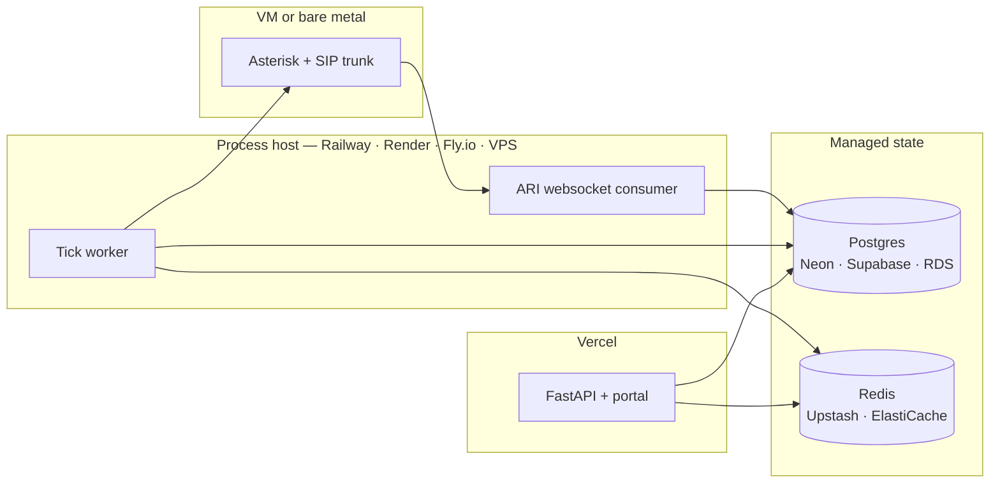

# Deployment

## Read this before deploying to Vercel

Vercel runs **the API and the portal**. It cannot run the two components that
make ChaanBean actually recover money, and a Vercel-only deployment will look
healthy while placing no calls at all.

| Component | Vercel | Why |
|---|---|---|
| FastAPI API | ✅ | Request-scoped; fits a serverless function |
| Portal (`/`) | ✅ | A single HTML file served from the same origin |
| **Scheduler** (`app/worker.py`) | ❌ | A tick loop claiming targets with `SELECT … FOR UPDATE SKIP LOCKED`. Serverless functions are request-scoped, so nothing advances the ladder |
| **ARI event consumer** (`app/telephony/events.py`) | ❌ | A persistent websocket. Call events are the source of truth, so without it `Call` rows are never projected |
| **Asterisk** | ❌ | A stateful SIP server needing UDP/RTP ports. Not a container Vercel can host |
| PostgreSQL / Redis | ❌ | Not provided; use managed services |

**What that means in practice.** A Vercel deployment gives you a working portal
backed by real data: sign in, add credit buyers, run credit checks, read the
ledger and the ageing report. Campaigns will not run, and no debtor will be
contacted, because nothing is driving the tick.

That is a legitimate deployment for a demo, a stakeholder review, or the
operations console itself. It is not a production deployment of the product.

---

## The realistic topology



If you would rather deploy the whole system to one place, **skip Vercel** and
use a host that runs processes — Railway, Render, or Fly.io all run the API and
the worker from the existing `docker-compose.yml` with far less assembly.

---

## Deploying the API and portal to Vercel

### 1. Provision state

Neither is optional; the app boots without them but every request fails.

**Postgres** — Neon or Supabase both work. You need a connection string for a
role that is **not** a superuser and **not** `BYPASSRLS`, because RLS is the
tenant isolation boundary and a superuser silently bypasses it even with
`FORCE ROW LEVEL SECURITY`. See [architecture §9](architecture.md#9-multi-tenancy-and-the-security-model).

> **Connection pooling is safe here by design.** The tenant is bound with
> `set_config('app.company_id', …, true)` — the third argument makes it
> *transaction*-scoped, so a transaction-mode pooler (PgBouncer, Neon's pooler,
> Supabase's port 6543) cannot leak a tenant into the next request on a reused
> connection. Session-level `SET` would have been unsafe with a pooler; this
> was chosen deliberately.

Use the **pooled** connection string on serverless. A function per request
against a direct connection exhausts Postgres connections quickly.

**Redis** — Upstash. Note that the throttle **fails closed**: when Redis is
unreachable, origination is refused rather than proceeding unmetered.

### 2. Apply the schema

Run migrations from your machine against the managed database, using an admin
role that can create roles and policies:

```bash
cd backend
DATABASE_URL_ADMIN="postgresql+psycopg://<admin>@<host>/<db>" python -m alembic upgrade head
DATABASE_URL_ADMIN="postgresql+psycopg://<admin>@<host>/<db>" python -m app.db rls
```

`app.db rls` creates the `crp_app` (NOBYPASSRLS) and `crp_worker` (BYPASSRLS)
roles and applies the tenant policies. Verify before exposing anything:

```bash
python -m app.db rls-report      # every tenant table: RLS on, FORCE on, 1 policy
```

### 3. Set environment variables

In the Vercel project (Settings → Environment Variables):

| Variable | Value |
|---|---|
| `DATABASE_URL` | pooled URL for the `crp_app` role |
| `DATABASE_URL_WORKER` | pooled URL for `crp_worker` |
| `REDIS_URL` | Upstash `rediss://` URL |
| `ENV` | `production` |
| `DEBUG` | `false` |
| `JWT_SECRET` | a fresh random 32+ byte secret |
| `AUTH_BACKEND` | `supabase` (or `local`) |
| `SUPABASE_URL` | your project URL |
| `SUPABASE_ANON_KEY` | the **publishable** key — never the secret key |
| `CONTACT_ALLOWLIST_ENFORCED` | `true` until a carrier is live |

Never set a Supabase secret or `service_role` key here. The server verifies
tokens against the published JWKS and needs no privileged Supabase key.

> `CONTACT_ALLOWLIST` must be set as a comma-separated list or left **unset**.
> An empty value is a startup error: pydantic-settings JSON-decodes list fields
> before validators run.

### 4. Update CORS

`app/main.py` allows `localhost:8000` only. Add your Vercel origin before the
portal will talk to the API from a browser.

### 5. Deploy

```bash
vercel --prod
```

The repo already contains `vercel.json`, `api/index.py` and a root
`requirements.txt`.

### 6. Verify

```bash
curl https://<your-app>.vercel.app/health
```

Expect `"status": "ok"` with `database: true` and `redis: true`. A `degraded`
response with `database: false` means the connection string or the pooler is
wrong — fix that before signing in, or every request will fail confusingly.

Also confirm the adapters reported by `/health`: if `telephony` still says
`fake`, no call would be placed even with a worker running.

---

## Deploying the worker

The worker is the same codebase with a different entrypoint:

```bash
python -m app.worker
```

Any host that runs a container works. It needs `DATABASE_URL_WORKER`,
`REDIS_URL`, and — once voice is live — network reach to Asterisk's ARI port.

Run **one** worker to start. It is safe to run several (target claiming uses
`FOR UPDATE SKIP LOCKED`, and origination is idempotent on a derived key), but
concurrency limits are enforced through Redis, so a partitioned Redis would let
two workers exceed the carrier's CPS ceiling.

---

## Before real calls

Voice is blocked on carrier provisioning, not on code. In order:

1. A SIP trunk and DIDs from an Indian carrier
2. Caller IDs registered and **carrier-approved** — an unapproved CLI is
   rejected outright, which is why they are rows with an approval state rather
   than a free-text field
3. TRAI DLT template registration
4. A DND/NCPR scrub feed — until one exists every number is `DND_UNKNOWN` and
   every call is refused, by design
5. `TELEPHONY_BACKEND=asterisk`, and `CONTACT_ALLOWLIST_ENFORCED=false` only
   once you intend to dial real debtors

[docs/provisioning-checklist.md](provisioning-checklist.md) and
[docs/going-live.md](going-live.md) cover this in full.
